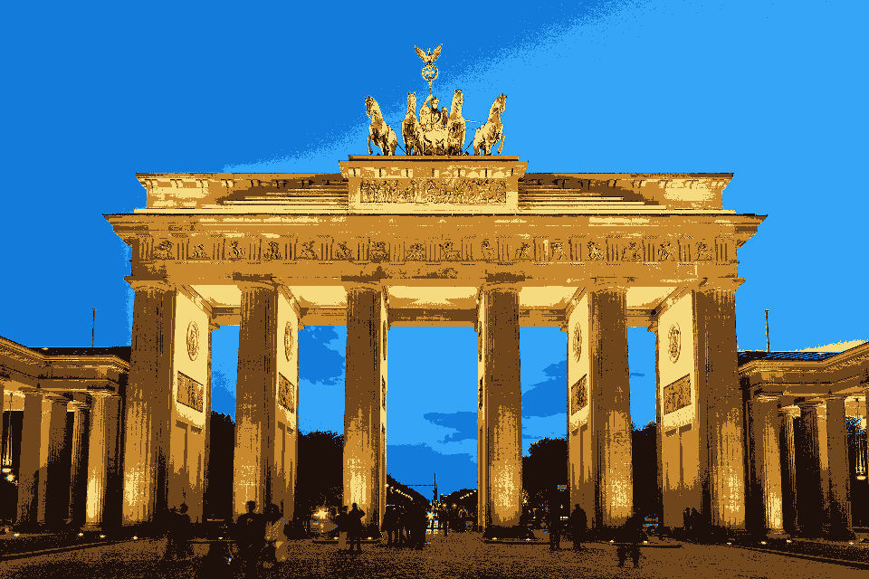
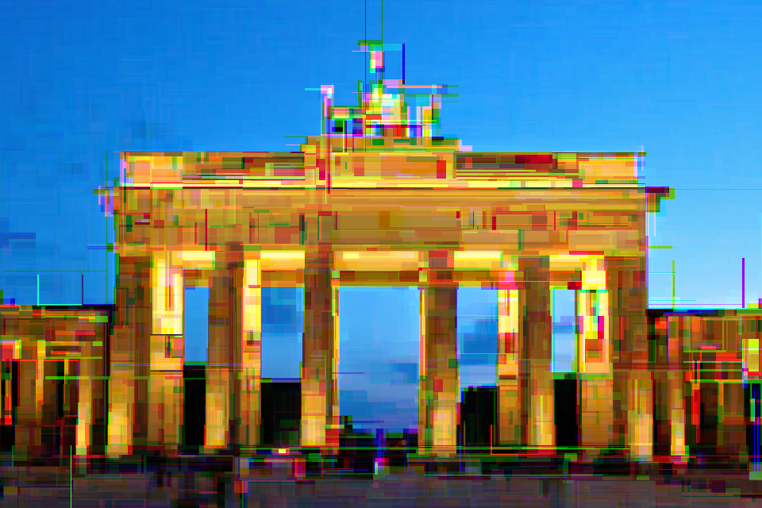
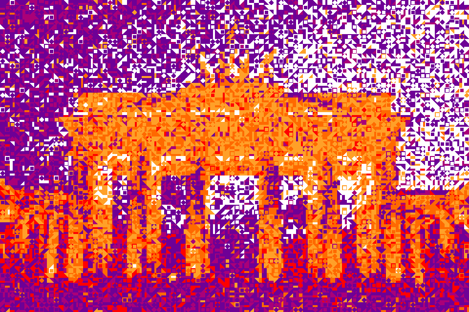

# Generative Art in Python

## Installation

**Step 1.** Clone the repository

**Step 2.** Install the libraries:

    pip install -r requirements.txt

## K-Means Clustering

    python decolorize.py

## Decision Tree Classifier

    python decision_tree.py

## Monte Carlo Sampling

    python mosaic_generator.py

    python animation.py

## More Generative Artists

* [Beetlesbot by Bleeptrack](https://beetles.bleeptrack.de/)
* [Flowerbot by Bleeptrack](https://blptrck.uber.space/flower/)
* [GalaxyKate](http://galaxykate.com/)

## Contact

(c) 2019 Dr. Kristian Rother (`krother@academis.eu`)

Distributed under the conditions of the MIT License. See `LICENSE for details

## References

[The Brandenburg Gate image](https://commons.wikimedia.org/wiki/File:Brandenburger_Tor_abends.jpg) is by Thomas Wolf, www.foto-tw.de / Wikimedia Commons / CC BY-SA 3.0
