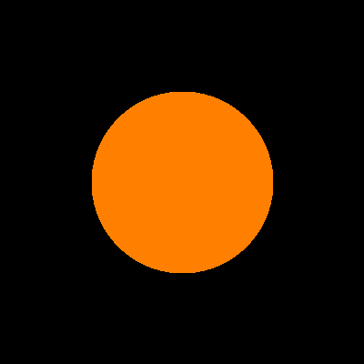
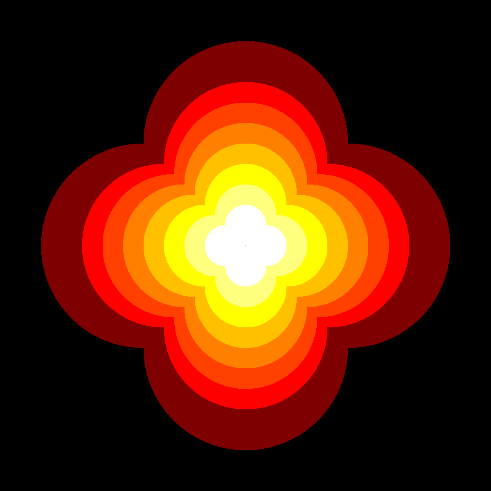
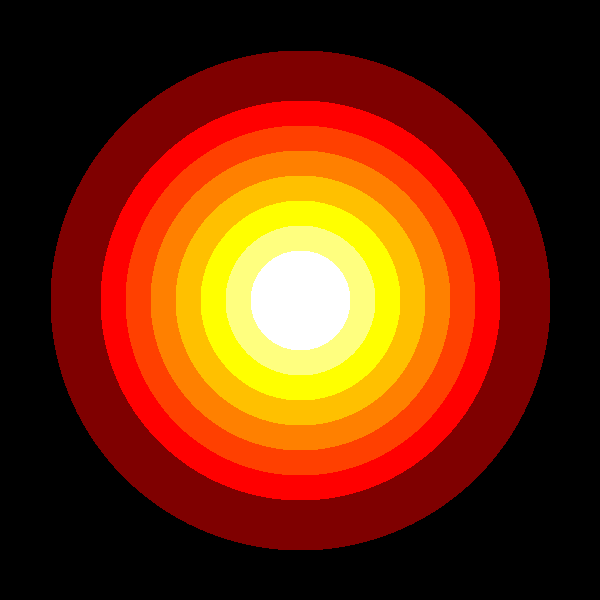
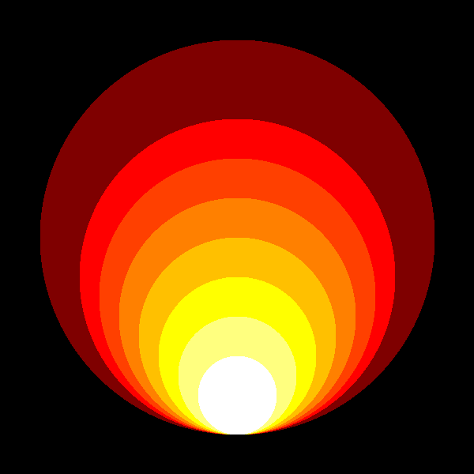

# Challenge: Circles

**Circles are drawn by calculating a 2D array of Euclidean distances and clipping.**

The code example below creates a single circle:

Adopt the code to create patterns from circles, e.g.:

