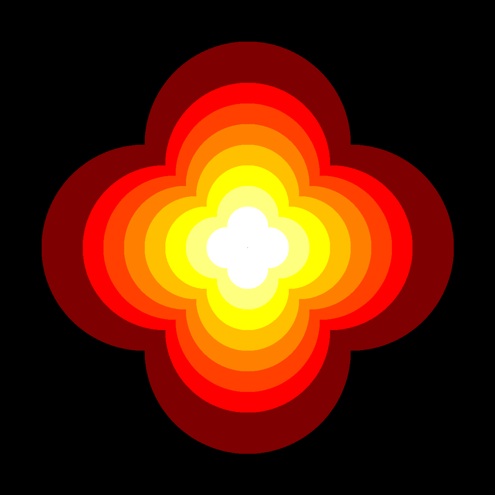

Circles
=======

**Circles are drawn by calculating a 2D array of Euclidean distances and
clipping:**

|image0|

Here is the code that creates the circle:

.. literalinclude:: circle.py

Hints
-----

-  the ``np.ogrid`` function creates two 2D-array of the X/Y coordinates
-  the ``square_dist`` contains the squared distance to the center for
   each pixel
-  for the mask, the rule of Pythagoras is applied to select points
   inside the circle

----

Challenge:
----------

Adopt the code to create patterns from circles, e.g.:

|image1|

|image2|

|image3|

.. |image0| image:: ../images/circle.png
.. |image1| image:: ../images/circle_challenge2.png
.. |image2| image:: ../images/circle_challenge3.png

