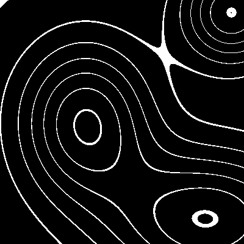

Contour Lines
=============

|image0|

How the image is created
------------------------

1. generate a regular grid of x and y positions
2. define x/y positions and widths of several hills
3. calculate the height of the hills as a Gaussian Mixture using the
   positions as means and the widths as standard deviations of a normal
   distribution, both for x and y separately
4. sum up the hills
5. scale and round the height to regular steps

You can put in any number of hills.

.. literalinclude:: contour.py

Lines only
----------

With a modulo instead of the rounded steps you get to see the contour lines or isolines:

|image1|

Challenge
---------

Generate random hill centers + sizes.

.. |image0| image:: ../images/contour_steps.png

