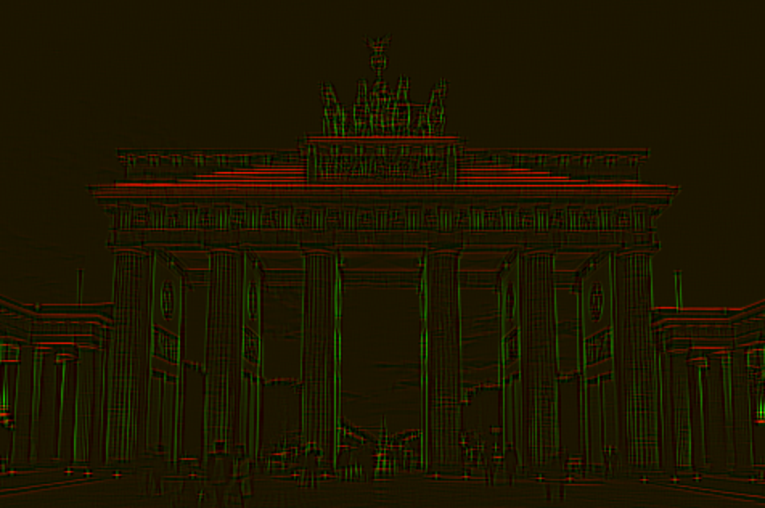

# Convolution

The script runs a 5x5 Convolutional Kernel over the image to recognize horizontal and vertical lines.

Then it draws the horizontal lines red and the vertical ones green.

:::include convolution.py

----

### Experimental: Deconvolution

I also attempted a 2D deconvolution. It works, but so far I could not set the weights in any way that it produces anything reasonable:

:::include deconvolution.py
