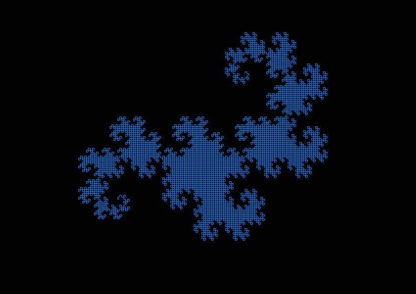

Dragon Curve
============

In this example, we use turtle graphics to generate fractals.

|image0|

The curve is generated from a self-similar sequence of left and right
turns. The basic pattern is :

::

   dragon(0) -> R

   dragon(1) -> dragon(0) + R + inverse(dragon(0) -> RRL

   dragon(2) -> dragon(0) + R + inverse(dragon(0) -> RRL

and so on. You find a detailed description on `Dragon Curve (Wikipedia) <https://en.wikipedia.org/wiki/Dragon_curve>`__

.. literalinclude:: dragon.py

Hints
-----

-  generate the curve for a small depth first
-  if the ``size`` parameter is too big, the program will crash because
   it reaches the array boundaries.

----

Challenge
---------

Try the following self-similar sequence:

::

   :::text
   seq(0) -> LRRL
   seq(1) -> seq(0) + L + seq(0) + R + seq(0) + R + seq(0) + L + seq(0)
   ...

