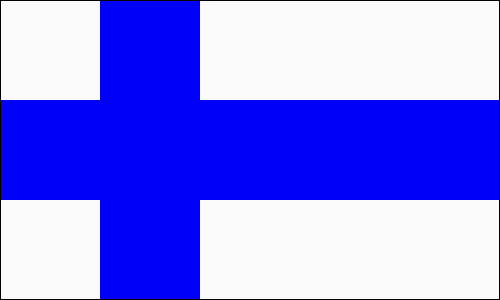

# Challenge: Flags

**Slicing NumPy arrays allows you to edit rectangular blocks of data.**

Draw the flag of a country of your choice, e.g.:

Use the code below as a starting point. It produces the following pattern.

