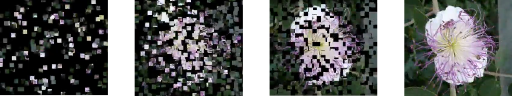

# Flower Assembly

## Challenge

Write an animation where an image assembles itself from pieces, like the [Flower Assembly Movie on YouTube](https://youtu.be/FE6_nx-MKc8).
Split the image into many square-shaped tiles and create a series of frames as `.png` images.

## You need

 * an image
 * Python + NumPy + Pillow
 * `MEncoder` or a similar program that can assemble several frames to an animation

With MEncoder, you need to run a line similar to the following:

    :::text
    mencoder "mf://*.png" -mf fps=25 -o output.avi -ovc lavc -lavcopts vcodec=mpeg4

## Hints

* start by creating a very simple animation (e.g. a square moving across the screen)
* you need about 25 frames per second
* a trick to create the assembly effect is to **move apart** the squares in random directions, and play that animation backwards
