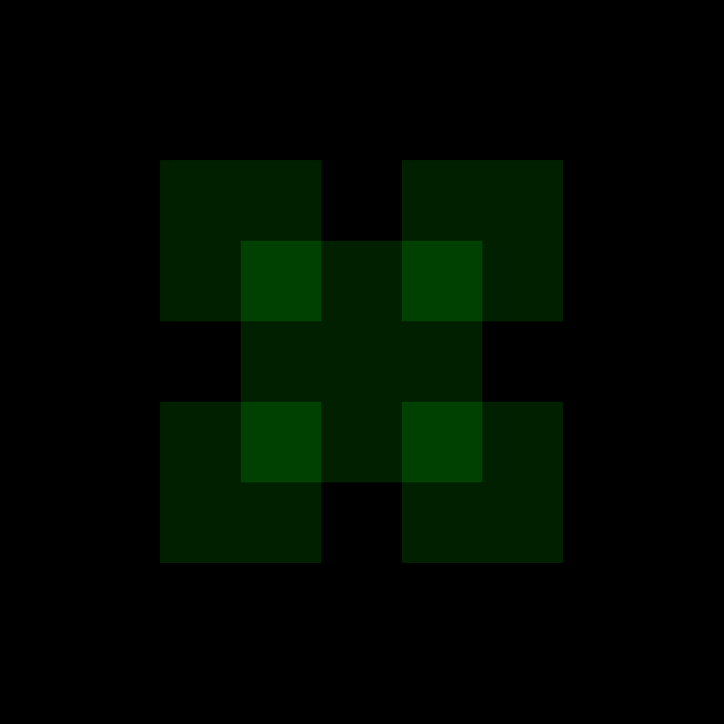

Fractal Square
==============

Without too much effort, you can draw a large square with four smaller squares in the corners:

|image0|

Things get more interesting, when you add even smaller squares to each of the four squares.
You can repeat the process, resulting in a **fractal image**:

|image0|

Challenge
---------

Complete the code and experiment using different variables like `b`-`e` and `xmin`, `ymax` for the coordinates:

.. literalinclude:: square.py

.. note::

   The idea of the fractal square was conceived from the infinite castle in `Kimetsu no Yaiba <https://en.wikipedia.org/wiki/Demon_Slayer:_Kimetsu_no_Yaiba>`__

