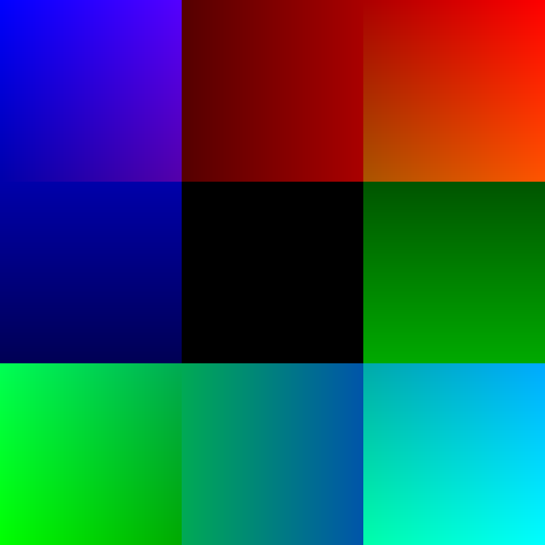

# Gradient

Let's create color gradients:

Here is the code that creates the gradients:

:::include gradient.py

The code first creates a grayscale gradient that is later copied into the RGB array.

### Hints

* the `np.linspace()` function creates numbers in evenly spaced intervals
* the parameters indicate the *first and last number and the number of points*
* by default it creates floating point numbers
* setting `dtype=np.uint8` rounds the numbers
* the `[::-1]` notation slices an array in the opposite direction

To create a vertical gradient, you need to transpose the image (swap x and y).

Note that you may need to create the gradient with swapped dimensions:

    :::python3
    vertical = np.zeros((1200, 300), dtype=np.uint8)
    vertical[:1200, :] = np.linspace(0, 255, 300, dtype=np.uint8)
    a[:, :1200, :, 0] = vertical.T

----

## Challenge

Mix horizontal and vertical gradients:

