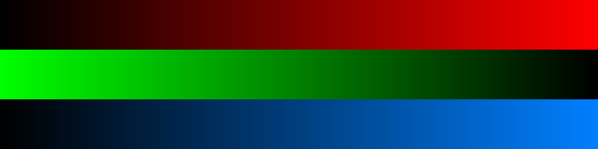
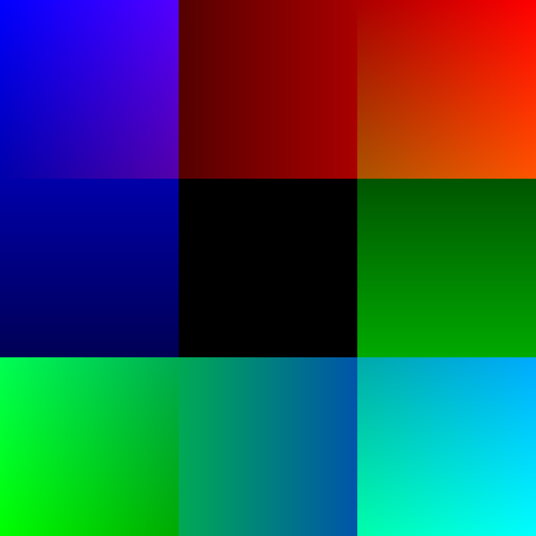

Gradient
========

Let’s create color gradients:

|image0|

Here is the code that creates the gradients:

.. literalinclude:: gradient.py

The code first creates a grayscale gradient that is later copied into
the RGB array.

|image1|

Hints
-----

-  the ``np.linspace()`` function creates numbers in evenly spaced
   intervals
-  the parameters indicate the *first and last number and the number of
   points*
-  by default it creates floating point numbers
-  setting ``dtype=np.uint8`` rounds the numbers
-  the ``[::-1]`` notation slices an array in the opposite direction

To create a vertical gradient, you need to transpose the image (swap x and y).

Note that you may need to create the gradient with swapped dimensions:

.. code:: python3

   vertical = np.zeros((1200, 300), dtype=np.uint8)
   vertical[:1200, :] = np.linspace(0, 255, 300, dtype=np.uint8)
   a[:, :1200, :, 0] = vertical.T

----

Challenge
---------

Mix horizontal and vertical gradients:

|image2|

