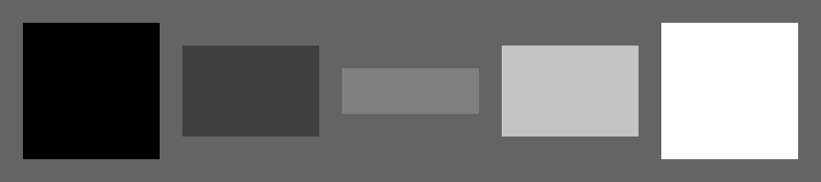

# Grayscale Images

The Pillow library can draw two-dimensional NumPy arrays as grayscale images:

Here is the code that generates the image:

:::include grayscale.py

Note that:

* the two dimensions are written as a tuple `(y-size, x-size)`
* the data type is `np.uint8` (numbers from 0..255)
* the example adds 128 to each value to obtain a gray image:

If you are using **Jupyter Notebook**, you can conveniently display any Pillow image variable by putting the image variable into a Jupyter cell, e.g.:

    :::python3
    im

----

## Challenges:

* create a rectangular image
* create a black square-shaped image
* create an image that is entirely white

