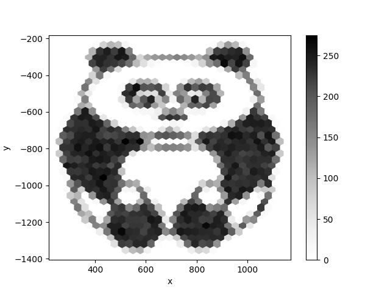

# Hexpanda

The script

1. puts the pixels of the original image into a pandas DataFrame
2. draws a random sample
3. creates a hexbin plot

There is a bit of data wrangling done, mostly messing with a pandas MultiIndex.

:::include hexpanda.py
