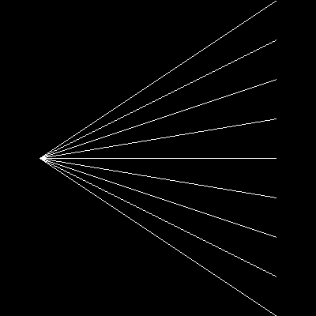

Lines
=====

Let’s draw lines:

|image0|

Here is the code that calculates lines:

.. literalinclude:: lines.py

Hints
-----

This is a rather primitive line drawing function. It applies a simple
linear function of the form ``ax + b`` The approach has a few
shortcomings:

-  you get exactly one y value for each x value, so it does not draw
   thicker lines
-  you cannot draw vertical lines
-  it is assumed that ``xstart <  xend``. If you swap the coordinates,
   nothing is drawn.

Of course you could patch your way around this by sorting the
coordinates in the function. Also, the ``PIL.ImageDraw`` module contains
a more powerful line drawing tool.

----

Challenge
---------

Create line art (remotely inspired from the artist **Naum Gabo**)

|image1|

.. |image1| image:: ../images/naumgabo.png
