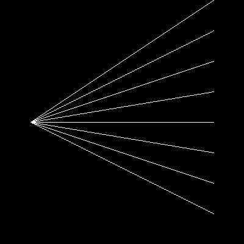
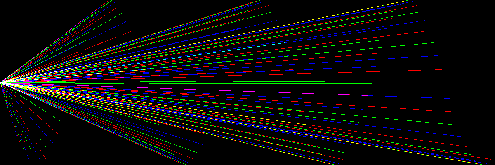

.. _lines:

Lines
=====

Let’s draw lines:

|image0|

Here is the code that calculates lines between two points:

.. literalinclude:: lines.py

Hints
-----

To properly draw lines in all directions, the algorithm has to
distinguish between a couple of cases:

* horizontal lines (easy)
* vertical lines (easy)
* diagonals where the x dimension is larger than y
* diagonals where the y dimension is larger than x

For both diagonals one has to interpolate points using a simple
linear function of the form ``ax + b``.
The larger dimension determines the number of points, so the interpolation
function is called twice, with x and y swapped.

.. note::
   
   The ``PIL.ImageDraw`` module contains a line drawing tool that
   allows you to draw thicker lines.   

----

Challenge
---------

Create line art (remotely inspired from the artist **Naum Gabo**)

|image1|

