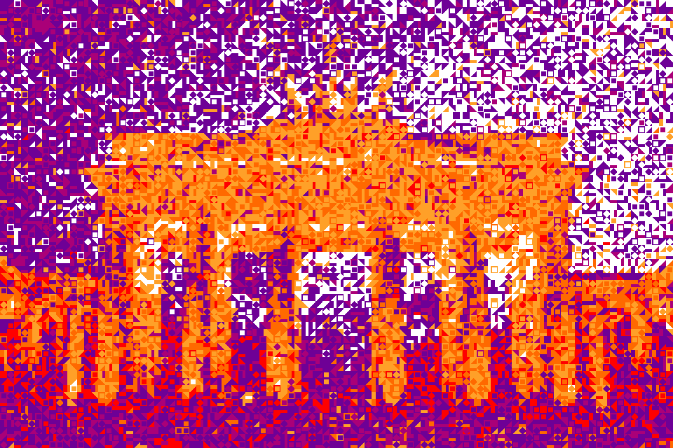

Monte Carlo Sampling
====================

|image0|

The Monte Carlo image generator approximate a target image by randomly placing tiles.
It accepts the change if the distance to the target image becomes smaller.

To try the algorithm, you need the files:

-  :download:`monte_carlo.py`
-  :download:`mosaic_generator.py`
-  :download:`patterns.py`

