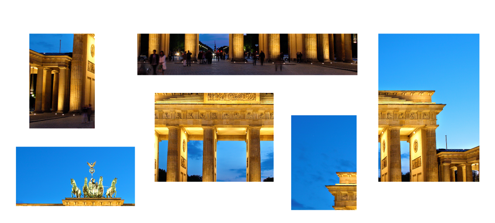

# Puzzle

**The Numpy functions vstack and hstack concatenate arrays.**

Assemble the complete picture from [these pieces](../images/pieces.zip)

Here is the code that assembles two of the pieces:

:::include puzzle.py

Hints:

* the functions `np.vstack` and `np.hstack` accept a list of NumPy arrays
* one dimension of the arrays needs to be identical
* use `print(x.shape)` a lot
* the order in which you assemble matters

----

## Challenge

Create your own puzzle.
