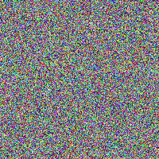
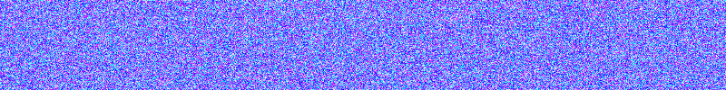

Random Blur
===========

The ``np.random`` module contains many random functions. We can use them
to generate random pixels:

|image0|

The ``np.random.ranint()`` function uses the uniform distribution:

.. literalinclude:: blur.py

Print the array to take a look at the values:

.. code:: python3

   print(a)

----

Challenges:
-----------

-  change the boundaries in the ``randint()`` function to create low
   amplitude noise
-  create grayscale blur
-  create a blue blur banner:

|image1|

