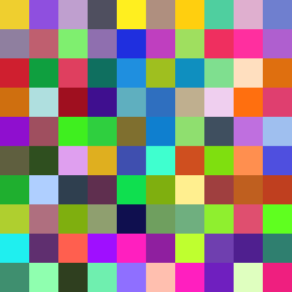

Random Tiles
============

The ``np.random`` module contains many random functions. We can use them
to generate random pixels:

|image0|

The ``np.random.randint()`` function uses the uniform distribution.
The ``np.kron()`` calculates the `Kronecker Product <https://en.wikipedia.org/wiki/Kronecker_product>`__ . 
We use it here to scale up the image.

.. literalinclude:: random_tiles.py

Print the array to take a look at the values:

.. code:: python3

   print(a)

----

Challenges:
-----------

-  change the boundaries in the ``randint()`` function to create low
   amplitude noise
-  create grayscale colors
-  discretize the color values to use only values divisible by 16
-  reproduce images in the style of `1024 Colors <https://www.gerhard-richter.com/de/art/paintings/abstracts/colour-charts-12/1024-colours-6083>`__ by **Gerhard Richter**

