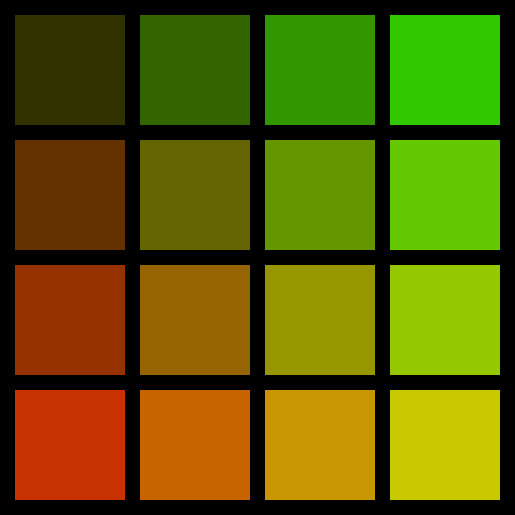

Repeat
======

|image0|

There are probably some Numpy tricks to do this without the for loop.

Whether the code gets any easier remains to be seen.

.. literalinclude:: repeat.py

----

Challenge
---------

Put together your own or random colors:

|image1|

