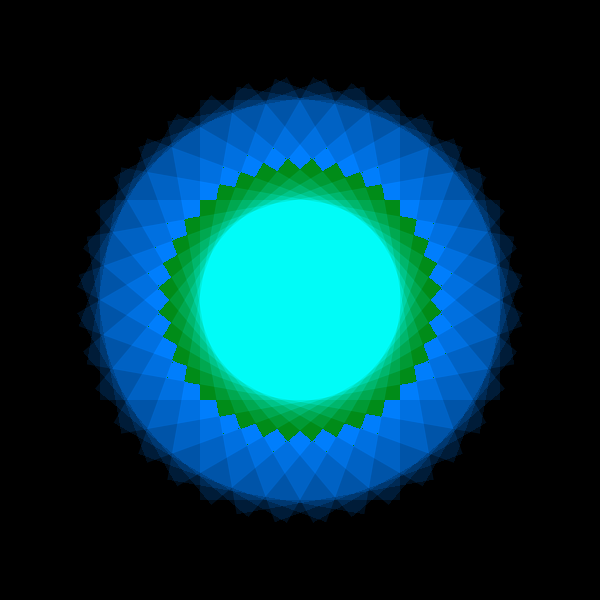
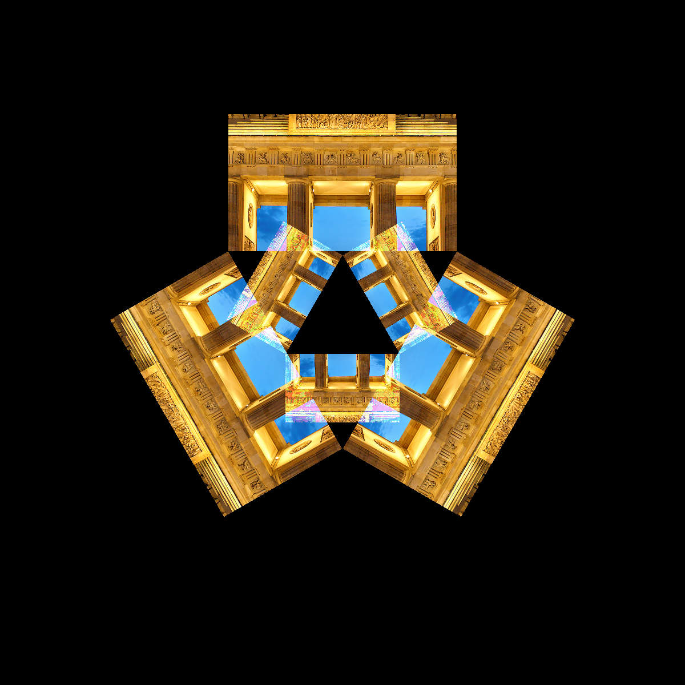

Rotation
========

|image0|

The image consists of many rotated rectangles copied on top of each
other.

.. literalinclude:: rotate.py

----

Challenge
---------

Create a caleidoscope image:

|image1|

