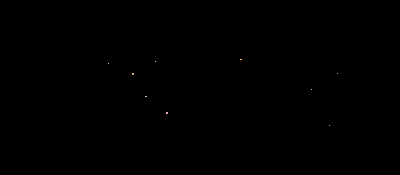

# Sand blows away

## How does it work

The basic mechanics of the animation are:

* every location of the image is covered by a grain of sand
* all grains are black while not moving
* every grain waits for a random time before it starts to move
* the movement starts slowly in a random direction
* a grain of sand has a color as soon as it starts to move
* every frame, the movement gets accelerated to the right

To make the animated GIF smaller, the image was shrunk and cropped.

The [Obi-Wan Kenobi Series by Disney](https://disneyplusoriginals.disney.com/show/obi-wan-kenobi) has a much better animation that inspired me to write my own.

## Prerequisites

This script requires two libraries: **OpenCV** for displaying the live animation and **imageio** for exporting animated GIFs.

    pip install opencv-python
    pip install imagio

## The Script

:::include sand.py

