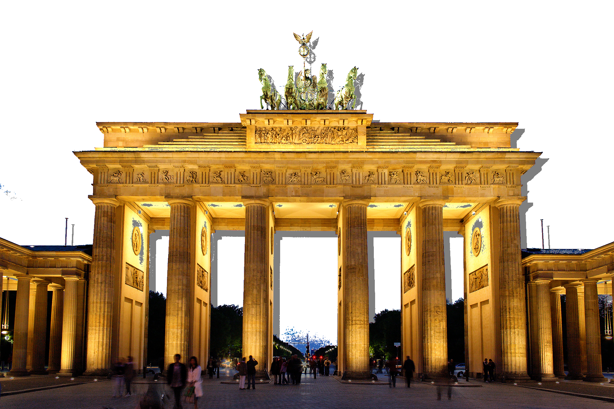

# Shadow

## How the image is created

1. select all blue pixels above a threshold as a mask
2. create a shadow image that is gray outside and white inside the mask
3. move the shadow by 20 pixels
4. copy the shadow onto the white part of the main picture

Note that some blue pixels do not turn white, because changing the threshold would distort the gate too much.

:::include shadow.py
