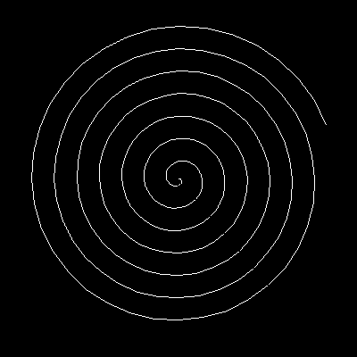
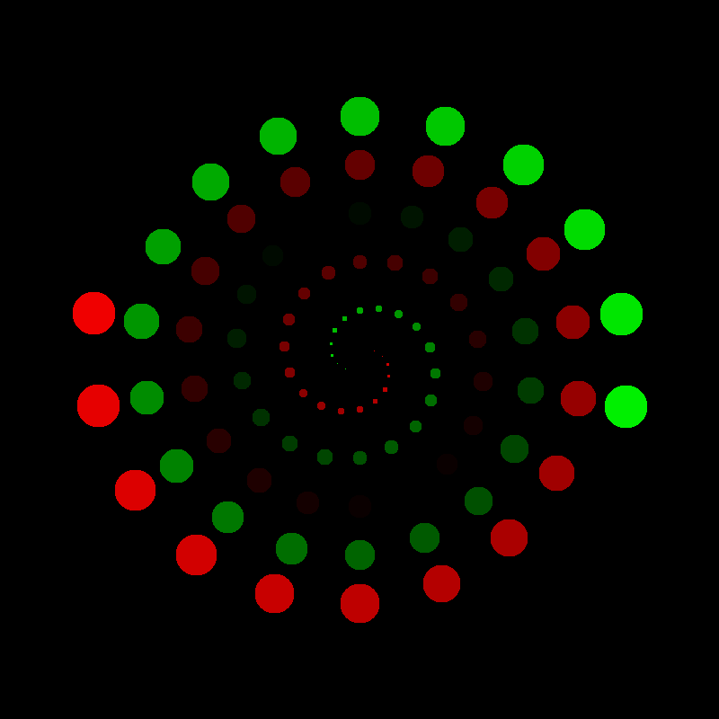

Spiral
======

|image0|

To draw a spiral you can reuse the :ref:`line drawing function <lines>`:

.. literalinclude:: spiral.py

When drawing a spiral it is key to **start in the middle**.
This allows to catch the essential properties of a spiral in code:

* it rotates in circles
* the radius of the circle becomes bigger and bigger
* the spiral is potentially endless

The angle and radius are **polar coordinates**.
You can convert them to **cartesian coordinates** through trigonometric functions.
A **generator function** is a good solution to model a *potentially endless* spiral.
The line drawing function takes care of the rest.

----

Challenge
---------

Become creative with the spiral function:

|image1|

