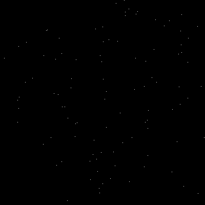
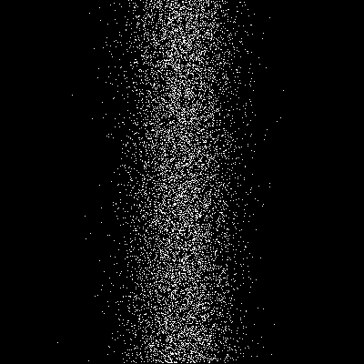

Stars
=====

**Index arrays with integer arrays to create dots.**

|image0|

.. literalinclude:: stars.py

----

Challenge:
----------

Create point clouds using other distribution functions.

|image1|

