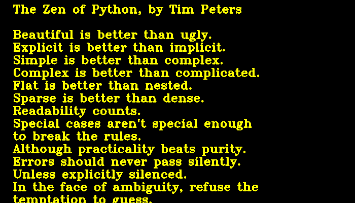

Star Wars Titles
================

Have you ever wondered how you could produce an animation like in the
Star Wars main titles?

Of course this can be done in Python:

|image0|

How it works:
-------------

The text uses the *“Zen of Python”* (obtained via ``import this`` and
adding a few line breaks). First, a plain image of the text is created.
In the script, OpenCV is used, but you can do the same with any image of
your choice, as long as the image is sufficiently long.

|image1|

The main challenge is to calculate the perspective. For every pixel *(x,
y)* on the screen, you want to know what is the closest pixel *(x0, y0)*
on the text image. The equations to calculate those are:

.. math::

   x0 = x - \frac{x \cdot y}{y-1}

.. math::

   y0 = - \frac{y \cdot c}{y-1}

where

-  **y** is a float in the range of 0..1.
-  **x**, **x0** and **y0** are absolute pixel positions
-  **c** is a constant for the distance of the observer. It defines how *“steep”* the trapezoid will be

In practice you need to do some scaling of these numbers to center the
animation on the screen.

There is probably a more efficient way to calculate the perspective
(using more linear algebra). But I found this solution from scratch on a
piece of paper and made it work fast enough.

Installation
------------

The script requires the **OpenCV** library for displaying the live
animation. A second script in the repository uses **imageio** for
exporting animated GIFs.

::

   pip install opencv-python
   pip install imagio

The code
--------

.. literalinclude:: starwars.py

.. |image0| image:: sw_animation.gif

