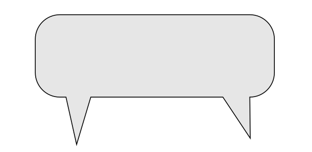

Thank You
=========

Here is a simple assembly of a **Thank You** image.

|image0|

How it works:
-------------

The script uses two images with characters, and one with the bubble:

|image1|

|image2|

|image3|

The main logic is to use a sine function to calculate smooth movements.
For frame *i* the coordinate *x* would be:

.. math::

   x = sin(\frac{i}{i_{max}} \cdot (end - start)) + start

At the end, the image is cropped, so that the logo parts seem to move in from the outside.

Installation
------------

The script requires the **OpenCV** library for displaying the live
animation and **imageio** for
exporting animated GIFs.

::

   pip install opencv-python
   pip install imageio

The code
--------

.. literalinclude:: thank_you.py

.. |image2| image:: pingu.png

