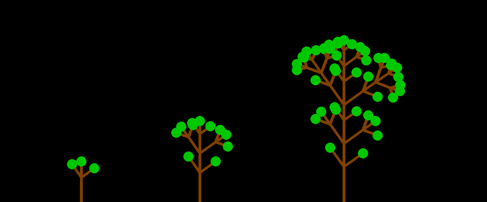

Fractal Canopy
==============

With a recursive combination of lines, you can draw tree-like structures.
The example code uses the `PIL` library for easier drawing of lines.

This code is a good starting point to develop your own branching patterns and leaves.

.. literalinclude:: tree.py

.. seealso::

   `Fractal Canopy on Wikipedia <https://en.wikipedia.org/wiki/Fractal_canopy>`__
